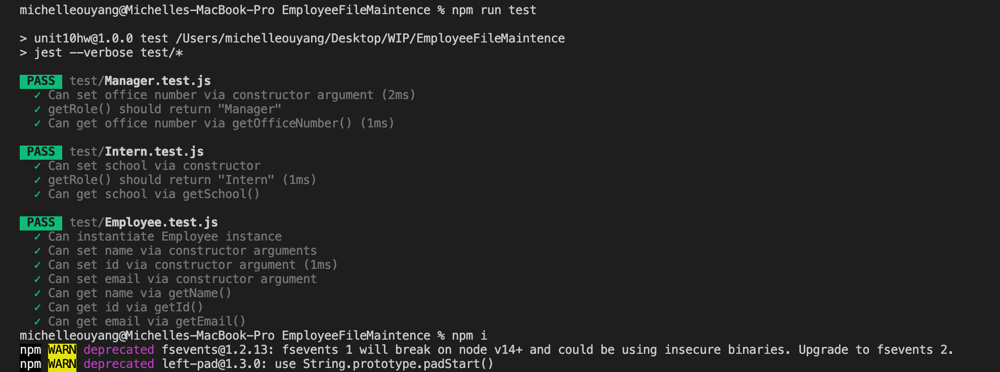
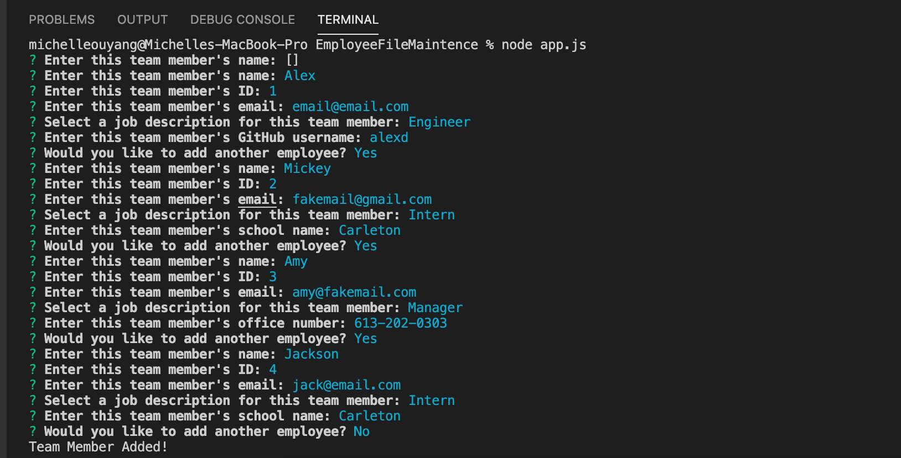
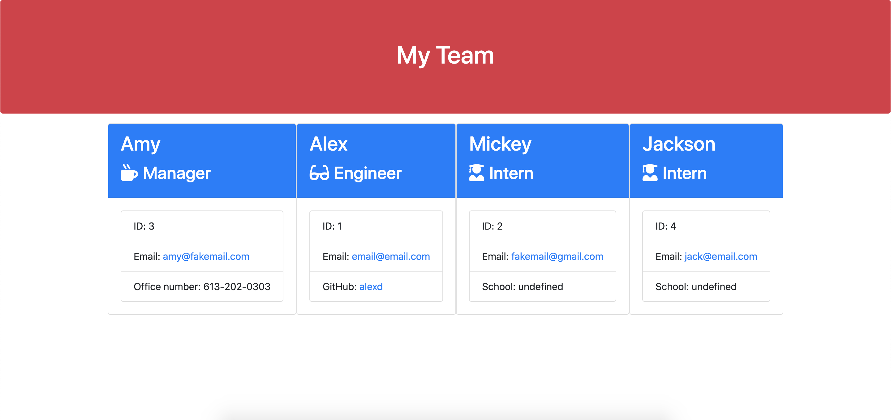

# EmployeeFileMaintence

Employee File Maintence is a CLI based app that allows users to create a formatted HTML page to display your teams' information. Team roles are divided into the following three catagories, Intern, Engineer and Manager. 

The populated HTML file will contain contact information of the team members, what schools interns attend to, managers' office number and Engineers' GitHub profile. 

## Screenshot

## User Story

As a manager, I want to be able to access my team's file, so that I can direct access to their contact information.

## Installation

Caution: This application is only operating on Terminal, not in browser.

### Step 1: Node Installation

Make sure download node.js before running the application. 
If you are not sure, type in "node -v" at the command line in Terminal.

### Step 2: Inquirer Installation 

Make sure before download Inquirer, go in to the local repository folder in terminal, 
then type in "npm i" at the command line, then let terminal do the job.

## Usage
Invoke app.js in Terminal, answer the prompted questions.
Detailed instructions will be included in the demo video.

## Instruction

https://drive.google.com/file/d/1INaOISQtZmn5jTXenVsGroiaQcMo2R5r/view
